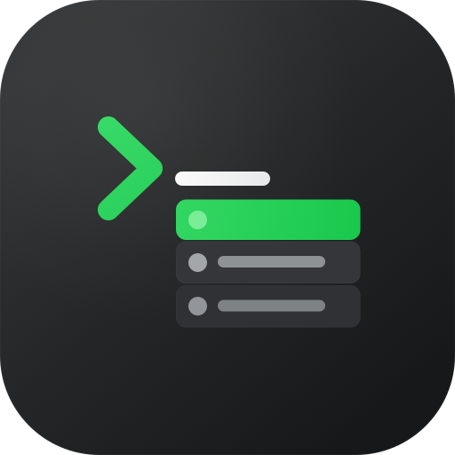
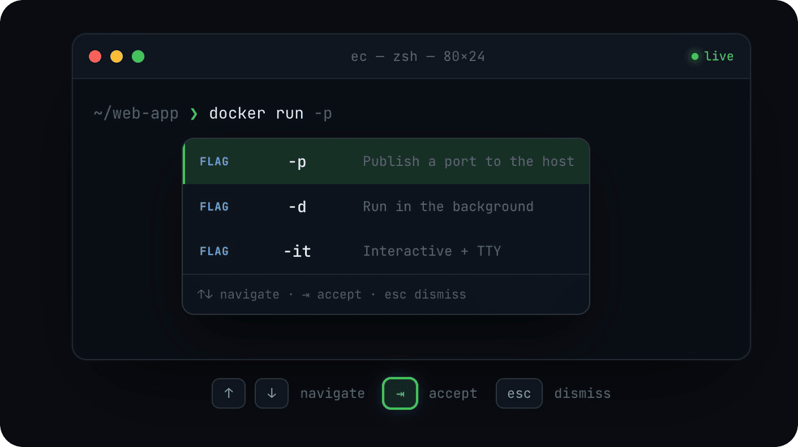

<p align="center">
  
</p>

<h1 align="center">Easy Complete</h1>

<p align="center">
  <b>为 macOS 终端打造的 IDE 风格行内自动补全。</b><br/>
  一款开源、纯本地、Fig 风格的命令行补全引擎，支持 <code>zsh</code>、<code>bash</code> 与 <code>fish</code>。
</p>

<p align="center">
  <a href="https://github.com/chen86860/easy-complete/releases"></a>
  
  
  <a href="#-许可证"></a>
  <a href="https://github.com/chen86860/easy-complete/stargazers"></a>
</p>

<p align="center">
  <a href="./README.md">English</a> · <b>简体中文</b>
</p>

**Easy Complete** 是一款 macOS 终端自动补全应用——以原生浮层窗口跟随光标，为你的 shell
提供 IDE 风格的行内补全。它只专注于终端自动补全这一件事——是一款轻量、完全本地、
开源的 Fig 替代品。

你会在输入 `git`、`npm`、`docker`、`cargo` 等数百种命令行工具时，获得类似 fish shell 的
建议：参数、子命令、文件路径、选项，边打边补。
自动补全完全在本机运行——无需账号、无云端调用、无 AI 请求，你的命令内容永远不会离开你的
Mac。应用会收集匿名使用统计（打开次数、每日补全次数——绝不包含命令内容），可随时通过
`ec telemetry disable` 关闭。完整的采集清单见[隐私页面](https://easy-complete.emmmm.dev/privacy-policy)。

<p align="center">
  
</p>

> **平台：** 已发布产品仅支持 macOS（Apple Silicon / ARM64 DMG）。
> Linux 与 Windows 仍是进行中的工作，见 [`CROSS_PLATFORM_PLAN.md`](./CROSS_PLATFORM_PLAN.md)。
> 尚未发运：没有 Linux 安装包，也没有 Windows 安装器。它们的 CI 只是编译/测试门禁，不是发货。

## 目录

- [安装](#-安装)
- [使用](#-使用)
- [卸载](#-卸载)
- [工作原理](#-工作原理)
- [开发](#-开发)
- [许可证](#-许可证)

---

## ⚡️ 安装

### Homebrew（推荐）

使用一条命令安装 Easy Complete：

```bash
brew install --cask chen86860/tap/easy-complete
```

安装完成后，从 `/Applications` 启动 **Easy Complete**，按提示授予**辅助功能**权限，
然后重新加载 shell：

```bash
exec $SHELL
```

首次启动时，Easy Complete 会设置随附的 CLI 二进制、shell 集成、输入法和登录启动项。可以
运行下面的命令确认安装状态：

```bash
ec doctor
```

### 手动下载 DMG

下载最新的 Apple Silicon DMG：

[下载最新版 DMG](https://github.com/chen86860/easy-complete/releases/latest/download/Easy-Complete-arm64.dmg) ·
[所有 Releases](https://github.com/chen86860/easy-complete/releases)

然后：

1. 打开 `Easy-Complete-arm64.dmg`。
2. 把 **Easy Complete.app** 拖到 `/Applications`。
3. 从 `/Applications` 启动 **Easy Complete**。
4. 按提示授予**辅助功能**权限。
5. 重新加载你的 shell：

   ```bash
   exec $SHELL
   ```

可以运行下面的命令确认安装状态：

```bash
ec doctor
```

### 从源码构建

如果你要做开发，或需要在本机自行构建，可以克隆仓库并运行安装脚本：

```bash
git clone https://github.com/chen86860/easy-complete.git
cd easy-complete
./install.sh
```

源码安装脚本会：

1. 构建 Rust 二进制和 TypeScript 前端。
2. 组装出 `Easy Complete.app` 并复制到 `/Applications`。
3. 把 `ec` 和 `ecterm` 两个 CLI 软链到 `~/.local/bin`。
4. 可在设置中开启**登录时启动**（macOS 13+ 使用系统登录项，macOS 12 回退到 LaunchAgent）。
5. 配置 shell 集成并注册输入法。
6. **弹出授予「辅助功能」权限的提示**（必需，见下文）。

完成后，重新加载你的 shell：

```bash
exec $SHELL
```

### 授予「辅助功能」权限

Easy Complete 需要把补全浮层定位到你当前聚焦的终端窗口，这依赖 macOS 的**辅助功能
（Accessibility）**权限。安装脚本会自动触发系统授权弹窗，请在以下位置勾选 **Easy Complete**：

> 系统设置 → 隐私与安全性 → 辅助功能

**如果补全始终不出现，几乎都是这个权限没授予。** 可用下面的命令重新触发授权弹窗：

```bash
ec debug prompt-accessibility
```

---

## 🚀 使用

安装并授权后，在任意受支持的终端里直接开始输入即可——建议会随输入实时出现在行内。

| 按键            | 操作           |
| --------------- | -------------- |
| `↑` / `↓`       | 在建议间移动   |
| `⇥` (Tab) / `→` | 采用高亮的建议 |
| `Esc`           | 关闭补全浮层   |

设置与引导面板（dashboard）可从**菜单栏的 Easy Complete 图标**打开。

常用 CLI 命令：

```bash
ec doctor                       # 诊断常见问题
ec diagnostic                   # 打印环境 / 集成状态
ec integrations install input-method   # （重新）注册 macOS 输入法
ec settings list                # 查看设置
ec settings <key> <value>       # 修改某项设置
```

### 受支持的终端

大多数终端通过 PTY 集成开箱即用——包括 iTerm2、Apple Terminal、VS Code、Cursor、
ChatGPT（Codex）以及 JetBrains IDE 终端。少数绕过标准 PTY 路径的终端（**Ghostty、Kitty、
WezTerm、Zed、Alacritty、Otty**）还需要依赖随附的输入法来追踪光标位置——这一项会在安装时
自动注册。

---

## 🗑️ 卸载

```bash
./scripts/uninstall.sh
```

该脚本会移除应用包、CLI 软链、LaunchAgent、输入法、shell 集成以及全部应用数据。它只会
精确移除 Easy Complete 自己的输入源，**不会动**你其它的键盘布局和输入法。

---

## 🧩 工作原理

Easy Complete 由三个相互协作的原生进程组成，通过 Unix 域套接字（Protobuf 消息）通信：

| 二进制          | Crate         | 职责                                                                                           |
| --------------- | ------------- | ---------------------------------------------------------------------------------------------- |
| `easy-complete` | `fig_desktop` | 原生应用宿主——GPUI 补全浮层与设置窗口、补全引擎工作线程、系统托盘、窗口管理 |
| `ecterm`        | `figterm`     | 介于 shell 与终端模拟器之间的伪终端；拦截 shell 编辑缓冲区以驱动补全                           |
| `ec`            | `ec_cli`      | CLI 入口——`setup`、`integrations`、`diagnostic`、`settings` 等                                 |

Shell 钩子（`.zshrc`、`.bashrc`、fish 配置）在每次提示符和按键时，把 shell 状态（当前目
录、命令文本、光标位置）回报给 `ecterm`。在 macOS 上，`fig_input_method` 辅助应用负责为绕
过 PTY 的终端上报光标位置。

**标识符**

- 应用 bundle ID：`dev.emmmm.easy-complete`
- 输入法 bundle ID：`dev.emmmm.easy-complete.inputmethod`
- 应用包路径：`/Applications/Easy Complete.app`

---

## 🛠️ 开发

### 工具链

- Rust `1.88.0`（在 `rust-toolchain.toml` 中固定），edition 2024
- Node `>=22.13 <23`，pnpm `11.14`
- TypeScript 构建图由 Turborepo 管理

### Rust

```bash
# 构建所有 release 二进制
cargo build --release -p fig_desktop -p figterm -p ec_cli -p fig_input_method

# 以 dev 模式运行单个 crate
cargo run --bin ec -- <子命令>
cargo run --bin easy-complete

cargo clippy --locked --workspace --color always -- -D warnings   # lint（CI 要求 -D warnings）
cargo fmt                                                         # 格式化
cargo test -p <crate_name>                                        # 测试某个 crate
```

不带 `-p` / `--workspace` 的 `cargo test` / `cargo build` 只构建 `crates/ec_cli`
（`default-members`）。`ec_overlay_spike` 是 Linux 浮层实验二进制，不会打进安装物。

### TypeScript

```bash
pnpm turbo build --filter="./packages/*"   # 构建所有包
node scripts/compile-spec-ir.mjs            # Fig spec → JSON IR + JS hook
pnpm lint                                   # lint
pnpm test                                   # 运行 Vitest
```

无界面补全：`cargo run --bin ec -- engine complete --buffer "git ch"`。
进程内存：`./scripts/memory-usage.sh`（`--watch 5`、`--peak`、`--csv mem.csv`）。

### 核心 crate

| Crate                   | 职责                                                    |
| ----------------------- | ------------------------------------------------------- |
| `fig_desktop`           | 原生应用宿主：GPUI 浮层与设置、托盘、引擎客户端         |
| `ec_gpui`               | 补全列表、主题、macOS 窗口定位                          |
| `ec_engine`             | 无界面补全：IR 查找、生成器、QuickJS hook               |
| `figterm`               | PTY 拦截、shell 编辑缓冲区追踪                          |
| `ec_cli`                | CLI crate，提供 `ec` 二进制及其所有子命令               |
| `fig_input_method`      | macOS 输入法辅助应用（光标追踪）                        |
| `fig_integrations`      | shell / 终端 / 编辑器集成的安装逻辑                     |
| `fig_ipc` / `fig_proto` | Unix 套接字 IPC 原语与生成的 Protobuf 类型              |

### 核心 TypeScript 包

| 包                    | 职责                                          |
| --------------------- | --------------------------------------------- |
| `autocomplete-parser` | 构建时由 `compile-spec-ir.mjs` 用来执行 Fig spec |
| `shell-parser`        | shell 命令行分词器                            |
| `api-bindings`        | 生成的 TS Protobuf IPC 绑定                   |

---

## 📜 许可证

采用 MIT 许可证。Easy Complete 基于上游 Amazon Q Developer CLI，并在
[LICENSE](./LICENSE) 中保留其原始版权声明。
第三方版权与许可证条款集中收录于
[THIRD_PARTY_NOTICES.txt](./THIRD_PARTY_NOTICES.txt)。
